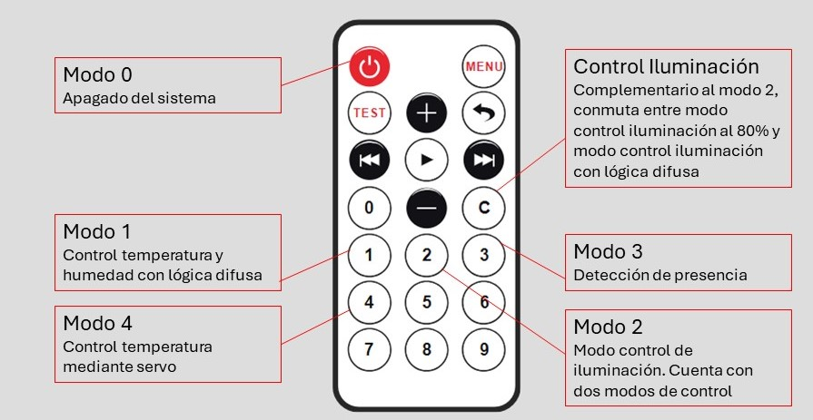

# EquiposAct 3
## Repositorio para Actividad 3 Equipos e Instrumentación
#### En esta actividad se propone incorporar la lógica difusa dentro de las funciones que realizaba el sistema prupuesto en la Actividad 2.

### Poyecto de partida:
#### Se parte del proyecto realizado en la actividad anterior que cuenta con un sistema de 4 modos:
|Modos|Funcionalidad|
|:----|------------:|
|Modo 0| Es el modo inicial del sistema, todo apagado|
|Modo 1| Modo que toma medidas de temperatura y humendad mediante el DHT11/22|
|Modo 2| Modo que toma medidas de iluminación mediante LDR|
|Modo 3| Modo que toda medidas para detectar la proximidad de un cuerpo (cm)|
|Modo 4| Modo control de temperatura en el interior de una habitación con un servomotor|

#### Los resultados de las mediciones a través del correspondiente sensor en cada modo se presentada en una pantalla LCD.

### El sistema propuesto en wokwi se presenta en la siguiente imagen

### Novedades incorporadas al sistema:
#### Nueva forma para cambiar de modo
Se ha elimiando el botón que se empleaba para pasa de un modo al siguiente. Se ha empleado un mando IR Remote para indicar a través de él el modo al que se 
desea entrar. En ls siguiente imagen se presenta las teclas y el modo al que conduce pulsarlas.

Se ha incorporrado además el correspondiente IR Receiver y definido el pin.

##### Nuevas funciones auxiliares incluidas para desarrollar el cambio de modos por mando
**translateIR():** Esta función se encuentra en al archivo Gestion_modos_IR.ino. Se recibe del mando la pulsación de una tecla y se comprueba la tecla pulsada y el modo al
que se debe cambiar.

#### Nuevo modo 1: Sistema de confort
Este nuevo modo toma **dos** medidas del sensor DHT11/22: 
|Medida|Funcionalidad|
|:----|------------:|
|Temperatura | Mediante el DHT para conocer temperatura|
|Humedad| Mediante el DHT para conocer la humedad|

**Lógica difusa para el sistema de confort de temperatura y humedad**
Fuzzy Logic. Se definen una serie de conjuntos difusos para temperatura, humedad y posición del servomotor:
| Conjunto difuso temperatura | Valores de FuzzySet|
|:----|---------------:|
|temperatura baja | -40, -10, 0, 10 | 
|temperatura media | 15, 20, 25, 30 |
|temperatura alta | 25, 40, 80, 80 | 

| Conjunto difuso humedad | Valores de FuzzySet|
|:----|---------------:|
|humedad baja | 0, 0, 30, 40 | 
|humedad media | 30, 40, 60, 70 |
|humedad alta | 60, 70, 100, 100 | 

| Conjunto difuso servo | Valores de FuzzySet|
|:----|---------------:|
|servo cerrado | 0, 0, 0, 45 | 
|servo medio | 45, 45, 90, 135 |
|servo abierto | 90, 135, 180, 180 | 

##### Nuevas funciones auxiliares incluidas para desarrollar el modo 1
**configuracionTyHFuzzy():** Contenida en el archivo Fuzzy_Confort.ino. Se crean los conjuntos difusos de la tablas de arriba y se definen una serie de reglas de forma que a mayor temperatura y humedad menos es la apertura/angulo del servomotor. A menos temperatura y humedad mayor es la apertura. 

#### Modificación del modo 2: Introducimos el control de iluminación con Fuzzy Logic
Modificación del modo 2 para control de la iluminación mediante lógica difusa. Se conserva el modo de control de iluminación al 80% de la actividad anterior y se añade otro modo
más basado en lógica difusa. La comuntación entre modos se hace mediante el mando IR Remote. Las dos opciones de control del modo 2 son:

| Modos | varibale ModoControl | Funcionalidad |
|:----|------|------:|
|Modo Fuzzy| 1 |Seleccion de leds a encender en función de la iluminación por lógica difusa|
|Modo control al 80%| 0 | Control de iluminación para lograr entorno al **80%** |

#### Nuevas funciones auxiliares incluidas para desarrollar el nuevo modo 2
**configuracionIluminacionFuzzy():** Contenida en el archivo Fuzz_Iluminacion.ino, se empela para definir los conjuntos difusos de iluminación para la lux medida y leds para el encendido de 8 leds y también el conjunto de reglas. Los conjuntos difusoso son los siguientes.

| Conjunto difuso lightInput | Valores de FuzzySet|
|:----|---------------:|
|oscuro | 0, 0, 200, 400 | 
| medio | 200, 400, 600, 800 |
|iluminado | 600, 800, 1000, 1000 | 

| Conjunto difuso ledOutput | Valores de FuzzySet|
|:----|---------------:|
|fewLeds | 0, 0, 2, 4 | 
|someLeds | 2, 4, 6, 8 |
|manyLeds | 6, 8, 8, 8 | 

##### Nuevas funciones auxiliares incluidas para desarrollar el modo 2
**encenderLeds():** Para el modo de control con Fuzzy, selecciona los leds que hay que encender según la fuzzy logic y los enciende. A menor iluminación más leds se encenderán.

**controlarIluminacion():**enciende leds hasta lograr una iluminación en torno al 80%, Si se supera el margen, apaga leds. Se establece un rango de iluminación entre 78% y 82%.

**mostrarIluminacion():**Muestra en el LDC la lux en % en el caso de control al 80% o un valor de 0 a 10000 en caso de control con Fuzzy cada vez que hay una actualización de su valor.

### NOTA IMPORTANTE WOKWI:
Para simular la repercusión de encender leds para lograr ese 80% se fuerzan variaciones de la variable lux que demuestren el funcionamiento de este modo. Se comienza con una medición tomada del sensor y después se continúa como valor de lux el resultante de la función **controlarIluminacion()**. Cuando se enciende un led más el lux obtenido se incrementa +2, cuando se apaga un led se reduce -2. De esta forma se espera simular el impacto que tendría en la realidad regular la iluminación de la sala.

### NOTA IMPORTANTE PINES:
Debido a la insufuencia de pines se reutilizan algunos para varias funcionalidades diferentes, como puede ser los leds del modo iluminación y el led RGB que sin ser empleado en este modo, su iluminación varía debido a compartir pines con otros leds.

